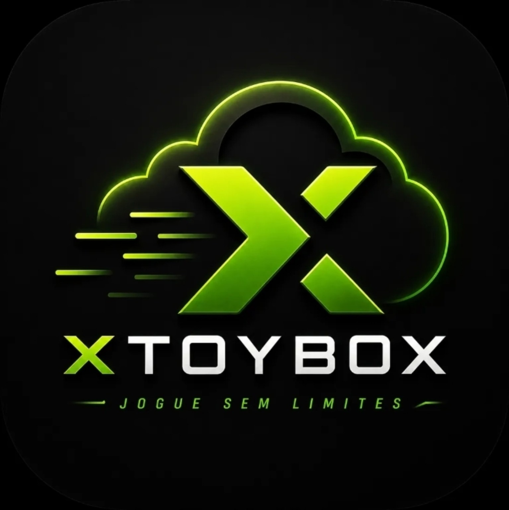

<p align="center">
  
</p>

<h1 align="center">XTOYBOX</h1>

<p align="center">
  App Android modificado para jogos na nuvem, Remote Play e uso em celular ou TV Box.
</p>

<p align="center">
  <a href="https://xtoybox.cloud"><strong>Site oficial</strong></a>
  ·
  <a href="https://discord.gg/abh27Dwktt"><strong>Comunidade</strong></a>
  ·
  <a href="https://github.com/jmita2288-debug/xtoybox-apk-download/releases"><strong>Releases do APK</strong></a>
</p>

<p align="center">
  
  
  
  
  
  
</p>

---

## Sobre o XTOYBOX

**XTOYBOX** é um projeto Android voltado para jogar na nuvem e usar Remote Play de forma mais prática em celulares, TV Box e dispositivos com controle.

O projeto nasceu a partir de uma base **open source do XStreaming**, mas recebeu modificações próprias, ajustes visuais, melhorias de desempenho, correções de bugs e mudanças na experiência de uso.

A ideia não é fingir que isso é uma empresa gigante ou um produto corporativo com vinte departamentos e café ruim em copo descartável. O XTOYBOX é um projeto independente, feito por um desenvolvedor iniciante, por diversão, aprendizado e vontade de modificar/melhorar um app que já tinha uma boa base.

> O objetivo é simples: melhorar a experiência, testar ideias, corrigir problemas reais e deixar o app mais agradável para quem usa jogos na nuvem.

---

## Base open source

O XTOYBOX é baseado em um projeto open source do **XStreaming**.

A partir dessa base, foram feitas modificações próprias para adaptar melhor o app ao uso pretendido:

- melhorias visuais na interface;
- ajustes em telas do app;
- reorganização de áreas como biblioteca, perfil e detalhes;
- correções de bugs encontrados durante testes;
- ajustes de desempenho e navegação;
- melhorias para uso em TV Box e controle;
- mudanças para deixar a experiência mais direta e confortável.

A base original continua sendo importante para o projeto. O XTOYBOX existe justamente como uma modificação feita sobre essa estrutura, com foco em aprendizado, personalização e melhoria prática.

---

## O que foi modificado

As modificações variam entre visual, comportamento e organização do app. Entre os principais pontos trabalhados estão:

| Área | O que foi feito |
| --- | --- |
| **Interface** | Ajustes visuais para deixar o app mais moderno, escuro, limpo e organizado. |
| **Biblioteca** | Melhor organização das listas de jogos, categorias e cards. |
| **Perfil** | Melhorias no visual da conta, progresso e atalhos. |
| **Conquistas** | Ajustes na apresentação de progresso, pontuação e jogos com conquistas. |
| **TV Box** | Adaptações de escala, navegação e uso com controle. |
| **Desempenho** | Correções para reduzir atrasos em abertura de telas, detalhes e listas. |
| **Streaming** | Ajustes para melhorar estabilidade e experiência durante o uso. |
| **Banners e imagens** | Correções de zoom, cortes, bordas e carregamento visual. |

Nem tudo está perfeito e nem tudo está finalizado. O projeto segue em evolução, com testes, correções e mudanças feitas conforme os problemas aparecem. Desenvolvimento real, infelizmente, não vem com botão mágico de “corrigir tudo sem quebrar nada”.

---

## Funções do app

O XTOYBOX foi pensado para facilitar o acesso a jogos na nuvem e Remote Play no Android.

Principais funções:

- jogar na nuvem em dispositivos Android;
- usar Remote Play;
- navegar pela biblioteca de jogos;
- abrir detalhes de jogos;
- acompanhar favoritos, histórico e progresso;
- visualizar conquistas;
- usar o app em celular ou TV Box;
- navegar com controle Bluetooth/USB;
- receber melhorias e versões pelo site oficial.

---

## Downloads do APK

<p align="center">
  <a href="https://xtoybox.cloud">
    
  </a>
</p>


```txt
public/download-stats.json
```


```txt
public/download-badge.json
```
 

## Sobre o site

Este repositório contém o **site oficial do XTOYBOX**.

O site foi criado para apresentar o projeto, divulgar versões, facilitar o download do APK e manter informações importantes em um lugar mais organizado.

Ele também serve para:

- mostrar uma visão geral do app;
- exibir imagens/telas do XTOYBOX;
- informar a versão mais recente;
- disponibilizar o APK para download;
- mostrar notas de atualização;
- direcionar usuários para suporte e comunidade;
- manter dados como contador de downloads e metadados da versão.

O site foi criado com apoio do **Lovable/MVP**, usado para acelerar a construção da primeira versão visual e facilitar ajustes rápidos. Depois disso, o projeto recebeu correções manuais, ajustes de layout, melhorias na API e mudanças para manter a identidade do XTOYBOX.

---

## Site oficial

<p align="center">
  <a href="https://xtoybox.cloud">
    
  </a>
</p>

O botão de download do site usa a rota:

```txt
/api/download
```

Essa rota tenta registrar o download e redireciona o usuário para o APK mais recente configurado no projeto.

---

## Como usar

1. Acesse o site oficial:

```txt
https://xtoybox.cloud
```

2. Toque em **Baixar APK**.

3. Instale o APK no Android.

4. Se o Android pedir permissão para instalar apps de fontes desconhecidas, permita apenas para o navegador ou gerenciador de arquivos usado.

5. Abra o XTOYBOX e faça os testes no seu dispositivo.

> Baixe sempre pelo site oficial ou pela página de releases do projeto. APK externo nunca deve ser tratado como risco zero, então use com atenção.

---

## Tecnologias usadas no site

O site foi construído com:

- **React**
- **TypeScript**
- **Vite**
- **TanStack Router**
- **Tailwind CSS**
- **Embla Carousel**
- **Lucide React**
- **Vercel**

Também existe configuração para trabalhar com metadados do APK, contador de downloads e redirects do arquivo mais recente.

---

## Estrutura do repositório do site

```txt
.
├── api/
│   ├── apk-metadata.js       # API que monta dados da versão atual
│   ├── download-badge.js     # Endpoint alternativo para badge abreviado
│   └── download.js           # Rota de download e contador
│
├── public/
│   ├── download-badge.json   # Badge abreviado usado pelo README
│   ├── latest.json           # Versão mais recente do APK
│   └── download-stats.json   # Estatísticas de downloads
│
├── src/
│   ├── assets/               # Logo e imagens do site
│   ├── components/           # Componentes de interface
│   ├── lib/                  # Funções auxiliares
│   ├── routes/               # Páginas e rotas
│   └── styles.css            # Tema visual e estilos globais
│
├── vercel.json               # Build, redirects e deploy
├── package.json              # Scripts e dependências
└── README.md
```

---

## Metadados do APK

A versão exibida no site é controlada por:

```txt
public/latest.json
```

Esse arquivo define:

- nome do app;
- versão mais recente;
- código da versão;
- URL do APK;
- canal de release;
- notas da atualização;
- data de publicação.

A API `/api/apk-metadata` usa essas informações para exibir o card de download no site.

---

## Contador de downloads

O contador de downloads usa o arquivo:

```txt
public/download-stats.json
```

Esse arquivo mantém o total geral e a divisão por versão. O site e o README usam essa mesma fonte para evitar números diferentes espalhados pelo projeto, porque aparentemente até estatística precisa de disciplina.

Para funcionar em produção, a Vercel precisa ter uma variável com permissão para gravar no repositório:

```txt
GITHUB_STATS_TOKEN
```

Também são aceitos estes nomes alternativos:

```txt
SITE_REPO_TOKEN
GH_TOKEN
```

Sem esse token, o download continua funcionando, mas o contador pode não aumentar.

---

## Rodando o site localmente

Instale as dependências:

```bash
npm install
```

Inicie o ambiente de desenvolvimento:

```bash
npm run dev
```

Gerar build de produção:

```bash
npm run build
```

Rodar preview local:

```bash
npm run preview
```

---

## Deploy

O deploy do site é feito pela **Vercel**.

Configuração principal:

```txt
vercel.json
```

Build usado em produção:

```bash
npx vite build --config vite.config.vercel.ts
```

Diretório final:

```txt
dist
```

---

## Comunidade e suporte

A comunidade do XTOYBOX fica no Discord.

Use o Discord para:

- tirar dúvidas;
- acompanhar avisos;
- reportar bugs;
- enviar feedbacks;
- acompanhar versões e mudanças.

<p align="center">
  <a href="https://discord.gg/abh27Dwktt">
    
  </a>
</p>

---

## Aviso importante

O XTOYBOX é um projeto independente.

Ele **não é oficial da Microsoft, Xbox, Xbox Cloud Gaming ou Game Pass**. Também não possui vínculo, parceria, aprovação ou afiliação com essas marcas.

Nomes, serviços e marcas citados pertencem aos seus respectivos donos.

---

## Nota do desenvolvedor

Este projeto foi feito por um desenvolvedor iniciante, com foco em aprendizado, prática e diversão.

A ideia sempre foi testar, modificar, melhorar e entender como as coisas funcionam na prática. Algumas partes podem mudar bastante com o tempo, principalmente conforme novos bugs aparecem ou novas ideias surgem.

Se você usa o XTOYBOX, testa versões, reporta problemas ou manda feedback, isso ajuda muito o projeto a evoluir.

---

<p align="center">
  XTOYBOX — modificação independente baseada em open source, feita por aprendizado e diversão.
</p>
