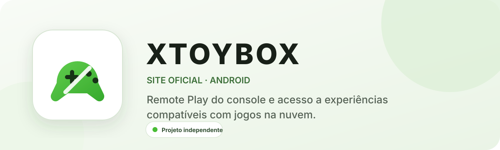
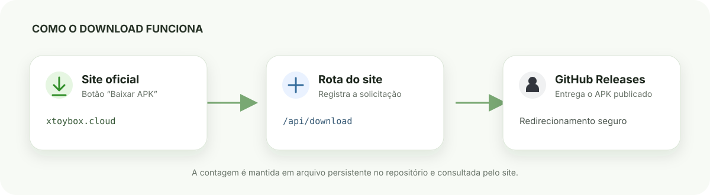

<p align="center">
  
</p>

<p align="center">
  <a href="https://xtoybox.cloud"><strong>Site oficial</strong></a>
  ·
  <a href="https://xtoybox.cloud/api/download"><strong>Baixar APK</strong></a>
  ·
  <a href="https://github.com/jmita2288-debug/xtoybox-apk-download/releases"><strong>Releases</strong></a>
  ·
  <a href="https://discord.gg/abh27Dwktt"><strong>Comunidade</strong></a>
</p>

<p align="center">
  
</p>

## Sobre este repositório

Este repositório contém o **site oficial do XTOYBOX**. Ele reúne a apresentação do projeto, a versão atual do APK, o fluxo de download, informações de suporte e os dados usados pelo contador de downloads.

O site também funciona como ponto central para:

- apresentar o aplicativo e suas principais formas de uso;
- disponibilizar o APK mais recente;
- exibir versão, tamanho e data de atualização;
- manter o contador de downloads;
- direcionar usuários para suporte, comunidade e reporte de problemas.

## O que é o XTOYBOX

O XTOYBOX é um projeto independente para Android voltado ao uso remoto do ecossistema Xbox. O aplicativo oferece recursos de **Remote Play do próprio console** e acesso a experiências compatíveis disponibilizadas por serviços oficiais de jogos na nuvem.

O XTOYBOX **não opera servidores próprios de cloud gaming** e não substitui serviços, contas ou assinaturas oficiais. Dependendo do recurso utilizado, uma conta Xbox, um console compatível ou uma assinatura válida podem ser necessários.

O aplicativo foi desenvolvido a partir da base open source do **XStreaming** e recebeu modificações próprias, incluindo:

- reorganização da biblioteca e de outras telas;
- ajustes de navegação para celular, TV Box e controle;
- melhorias visuais e de legibilidade;
- correções de bugs e ajustes de estabilidade;
- otimizações de carregamento, imagens e resposta da interface;
- mudanças em perfil, conquistas, detalhes de jogos e modo TV.

O projeto continua em evolução, com mudanças feitas a partir de testes, problemas encontrados no uso real e feedback da comunidade.

## Principais formas de uso

| Recurso | Descrição |
| --- | --- |
| **Remote Play** | Conexão com o próprio console Xbox para jogar em outro dispositivo compatível. |
| **Jogos compatíveis na nuvem** | Acesso a experiências oferecidas por serviços oficiais, conforme a disponibilidade da conta. |
| **Celular e TV Box** | Interface adaptada para toque, controle físico e telas maiores. |
| **Biblioteca e perfil** | Navegação por jogos, histórico, favoritos, progresso e conquistas. |

## Como o download funciona

<p align="center">
  
</p>

Todos os botões de download do site utilizam a rota:

```text
/api/download
```

Essa rota registra a solicitação no contador persistente e depois redireciona o usuário para o APK configurado como versão atual.

Os principais arquivos envolvidos são:

| Arquivo | Função |
| --- | --- |
| `public/latest.json` | Define a versão atual, a URL do APK, as notas e a data de publicação. |
| `public/download-stats.json` | Mantém o total geral e a divisão dos downloads por versão. |
| `public/download-badge.json` | Fornece a contagem abreviada exibida neste README. |
| `api/download.js` | Registra o download e realiza o redirecionamento. |
| `api/apk-metadata.js` | Reúne metadados da versão e das releases para o site. |

### Persistência do contador

Em produção, a função de download precisa de um token com permissão para atualizar os arquivos de estatísticas no repositório.

Variável recomendada:

```text
GITHUB_STATS_TOKEN
```

Nomes alternativos aceitos pelo projeto:

```text
SITE_REPO_TOKEN
GH_TOKEN
```

Sem uma dessas variáveis, o APK ainda pode ser entregue, mas a atualização automática do contador pode não ser registrada.

## Tecnologias

O site utiliza uma base moderna em React e TypeScript, com os seguintes componentes principais:

| Camada | Tecnologias |
| --- | --- |
| **Interface** | React, TypeScript, Tailwind CSS e Lucide React |
| **Build** | Vite |
| **Navegação** | TanStack Router |
| **Componentes** | Radix UI e componentes próprios |
| **Carrosséis** | Embla Carousel |
| **Validação e formulários** | Zod e React Hook Form |
| **Hospedagem** | Vercel |

## Executando localmente

Com Node.js e npm instalados, clone o repositório e execute:

```bash
npm install
npm run dev
```

Outros comandos disponíveis:

```bash
npm run build      # gera o build de produção
npm run preview    # abre uma prévia do build
npm run lint       # executa as verificações do projeto
npm run format     # formata os arquivos com Prettier
```

## Estrutura do projeto

```text
.
├── api/
│   ├── apk-metadata.js
│   ├── download-badge.js
│   └── download.js
├── docs/
│   ├── download-flow.svg
│   └── readme-banner.svg
├── public/
│   ├── download-badge.json
│   ├── download-stats.json
│   └── latest.json
├── src/
│   ├── assets/
│   ├── components/
│   ├── lib/
│   ├── routes/
│   ├── download-counter.css
│   ├── refined-site.css
│   └── styles.css
├── vercel.json
├── vite.config.vercel.ts
├── package.json
└── README.md
```

## Versão e metadados do APK

A versão apresentada no site é controlada principalmente por:

```text
public/latest.json
```

Esse arquivo informa:

- nome do aplicativo;
- versão e código da versão;
- URL do APK;
- canal da release;
- notas de atualização;
- data de publicação.

Ao publicar uma nova versão, essas informações devem ser revisadas para que o site, a API e os botões de download permaneçam sincronizados.

## Deploy

A publicação do site é feita pela **Vercel**. As principais opções de produção ficam em `vercel.json`.

Comando de build utilizado:

```bash
npx vite build --config vite.config.vercel.ts
```

Diretório de saída:

```text
dist
```

## Origem e créditos

O aplicativo XTOYBOX utiliza como base o projeto open source **XStreaming**, creditado a Geocld e distribuído sob a licença MIT no projeto original.

A primeira versão visual deste site contou com apoio do **Lovable/MVP** para acelerar a estrutura inicial. Depois disso, o projeto recebeu alterações manuais de interface, conteúdo, APIs, responsividade, download e identidade visual.

O XTOYBOX é mantido como um projeto independente, criado com foco em aprendizado, personalização e melhoria contínua.

## Comunidade e suporte

Problemas, dúvidas e sugestões podem ser enviados pelos canais do projeto:

- [Comunidade no Discord](https://discord.gg/abh27Dwktt)
- [Página para reportar bugs](https://xtoybox.cloud/reportar-bugs)
- [Releases do APK](https://github.com/jmita2288-debug/xtoybox-apk-download/releases)

Relatos com modelo do aparelho, versão do Android, versão do XTOYBOX e etapas para reproduzir o problema ajudam bastante na investigação.

## Aviso

O XTOYBOX é um projeto independente e não possui vínculo, parceria, aprovação ou afiliação com Microsoft, Xbox, Xbox Cloud Gaming ou Game Pass.

Todos os nomes, marcas e serviços citados pertencem aos seus respectivos proprietários.

---

<p align="center">
  <strong>XTOYBOX</strong><br />
  Projeto independente para Android, baseado em software open source.
</p>
